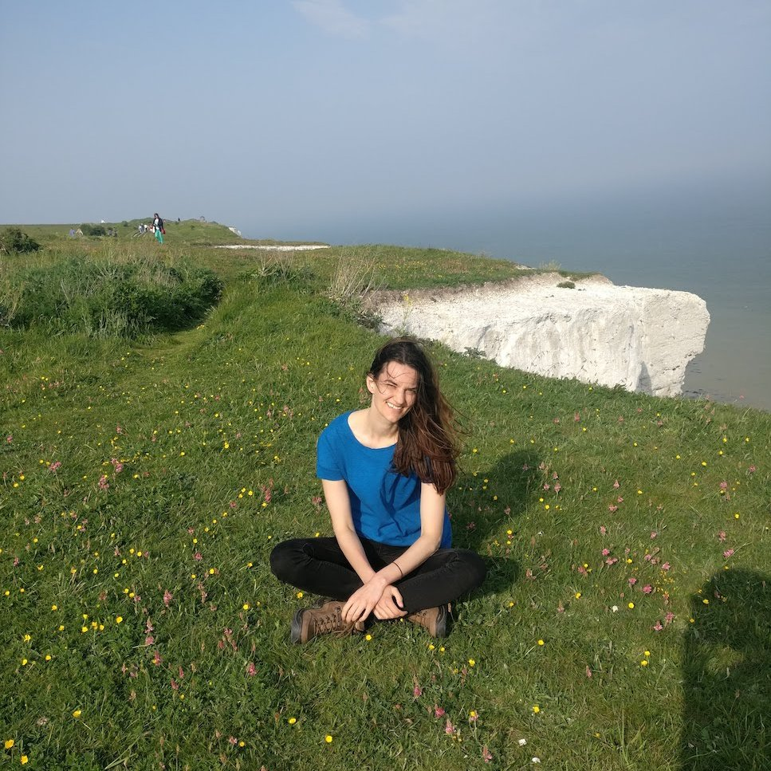

 




                
    

      
      <em>Dover, UK 2018.</em>
    

    

        
Hi,

        
I am Maren. I am a postdoctoral researcher at the
          <a href="https://uni-tuebingen.de/fakultaeten/mathematisch-naturwissenschaftliche-fakultaet/fachbereiche/informatik/lehrstuehle/methoden-des-maschinellen-lernens/personen/">
            University of T&uuml;bingen,
          </a> 
          however a lot of my time I spend in Berlin. 
          I am 
          <a href="{{ site.baseurl }}">
            interested in
          </a>
        
 
        

          <ul>
            <li>Stochastic optimization.</li>
            <li>Probabilistic Numerics (the inner loop).</li>
            <li>Statistical Emulation (the outer loop).</li>
            <li>Open Source.</li>
          </ul>
          <ul style="list-style: none; margin: 0; padding: 0; display: inline-flex; font-size: 0.9em">
            
          </ul>  
        

        

             
        

    

---

## News

- 10/2021: I am **co-organizing** the Dagstuhl Seminar on [*Probabilistic Numerical Methods - From Theory to Implementation*](https://www.dagstuhl.de/en/program/calendar/semhp/?semnr=21432) 
  Wadern, Germany. 
- 09/2021: I started a blog.
- 07/2021: Our **paper** [*Dynamic Pruning of a Neural Network via Gradient Signal-to-Noise Ratio*](https://openreview.net/pdf?id=34awaeWZgya) 
  of my intern *Julien Siems* at Amazon Web Services has been accepted at the 
  [*8th ICML Workshop on Automated Machine Learning*](https://sites.google.com/view/automl2021) (AutoML) 2021.
- 05/2021: I got majorly involved in the **open source** project [ProbNum](http://probnum.org).
- 05/2021: **I joint the group Methods of Machine Learning**
  ([MoML](https://uni-tuebingen.de/en/fakultaeten/mathematisch-naturwissenschaftliche-fakultaet/fachbereiche/informatik/lehrstuehle/methoden-des-maschinellen-lernens/personen/))
  headed by Philipp Hennig as a PostDoc @ University of T&uuml;bingen, Germany.

For older news, click [here]({{ site.baseurl }}) .

---
## Background

Ex Amazon Retail, ex AWS Sagemaker, Max-Plank Alumni. 
Currently, back in academia. 

  

    
  

  

        

          05/2021 - today: &nbsp;&nbsp;&nbsp; &nbsp;&nbsp; University of T&uuml;bingen 
                            &nbsp;&mdash;&nbsp; (Post Doc)
        

  

  

    
  

  

        

          06/2020 - 04/2021: &nbsp;&nbsp;&nbsp;Amazon Web Services 
                              &nbsp;&mdash;&nbsp; (Machine Learning Scientist)
        

  

  

    
  

  

        

          03/2018 - 05/2020: &nbsp;&nbsp;&nbsp; Amazon.com 
                              &nbsp;&mdash;&nbsp; (Machine Learning Scientist)
        

  

  

  
  

  

        

          08/2013 - 02/2018: &nbsp;&nbsp;&nbsp; Max Planck Institute for Intelligent Systems
                              &nbsp;&mdash;&nbsp; (PhD)
        

  

  

  
  

  

        

          07/2016 - 09/2016: &nbsp;&nbsp;&nbsp; Amazon.com 
                             &nbsp;&mdash;&nbsp; (Applied Science Intern)
        

  

  

  
  

  

        

          01/2013 - 07/2013: &nbsp;&nbsp;&nbsp; University of Goettingen 
                              &nbsp;&mdash;&nbsp; (PhD-1, discontinued)
        

  

  

    
  

  

        

          07/2012 - 12/2012: &nbsp;&nbsp;&nbsp; Max Planck Institute Developmental Biology
                              &nbsp;&mdash;&nbsp; (PhD-1)
        

  

  

    
  

  

        

          09/2008 - 07/2009: &nbsp;&nbsp;&nbsp; Middle East Technical University
                              &nbsp;&mdash;&nbsp; (ERASMUS exchange)
        

  

  

    
  

  

        

          10/2005 - 11/2011: &nbsp;&nbsp;&nbsp; University of T&uuml;bingen 
                              &nbsp;&mdash;&nbsp; (Studies towards Diplom in physics; equiv to MSc.)
        

  

---

## Projects

For projects, click [here]({{ site.baseurl }}) .

---

## Publications

For a list of publications, click [here]({{ site.baseurl }}) .
Google Scholar page [here](https://scholar.google.com/citations?user=krBt_aIAAAAJ&hl=de).

---
 
