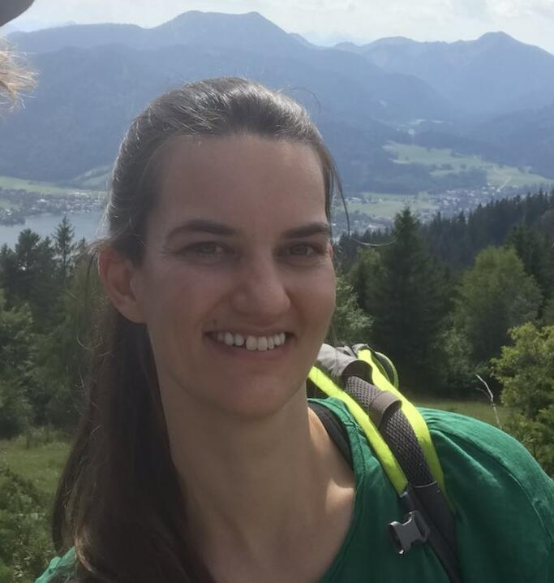
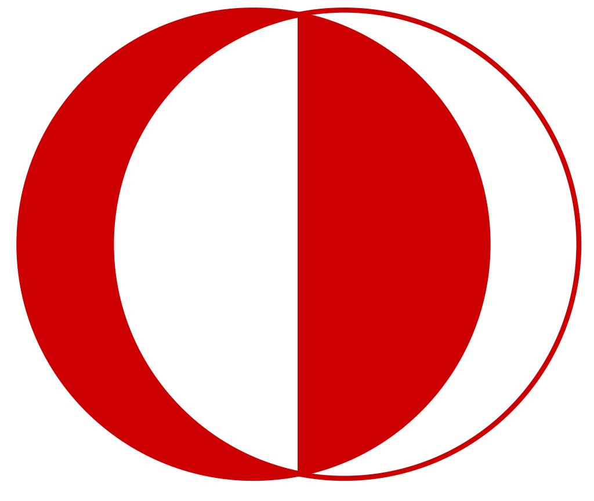

---
 

  
  <em>
    Hiking, Munich 2021.
  </em>

Hi, I am **Maren**. Welcome to my blog. 

I am a machine learning scientist currently at the 
[University of T&uuml;bingen](https://uni-tuebingen.de/fakultaeten/mathematisch-naturwissenschaftliche-fakultaet/fachbereiche/informatik/lehrstuehle/methoden-des-maschinellen-lernens/personen/), 
however most of my time I spend in Berlin.

I am interested in 

<ul>
  <li>Stochastic optimization.</li>
  <li>Probabilistic Numerics (the inner loop).</li>
  <li>Statistical Emulation (the outer loop).</li>
  <li>Open Source.</li>
</ul>
<ul style="list-style: none; margin: 0; padding: 0; display: inline-flex; font-size: 0.9em">
  
</ul>  

     

**About the blog:** Over the years I have accumulated a bunch of scripts and notes, created mostly with the intent to visualize, 
teach or remind myself of basic or novel concepts in machine learning and statistics 
(and sometimes I create them just for fun).
In case someone finds them interesting or helpful, I thought I'd put them online and polish them one-by-one 
whenever I find the time by adding them to the tech blog :) Also, I wanted to teach myself some html and Jekyll..

---

## News

For older news, click [here]({{ site.baseurl }}) .

---
## Background

Ex Amazon Retail, ex AWS Sagemaker, Max-Plank Alumni. 
Currently, back in academia. 

  <ul style="list-style: none; line-height:200%; margin-left: -30px; padding-left: 0px; ">
    <li>
        
        

          05/2021 - today: &nbsp;&nbsp;&nbsp; &nbsp;&nbsp; University of T&uuml;bingen 
                            &nbsp;&mdash;&nbsp; (Post Doc)
        

    </li>
    <li>
        
        

          06/2020 - 04/2021: &nbsp;&nbsp;&nbsp;Amazon Web Services 
                              &nbsp;&mdash;&nbsp; (Machine Learning Scientist)
        

    </li>
    <li>
        
        

          03/2018 - 05/2020: &nbsp;&nbsp;&nbsp; Amazon.com 
                              &nbsp;&mdash;&nbsp; (Machine Learning Scientist)
        

    </li>
    <li>
        
        

          ??/2013 - 02/2018: &nbsp;&nbsp;&nbsp; Max Planck Institute for Intelligent Systems
                              &nbsp;&mdash;&nbsp; (PhD candidate)
        
 
    </li>
    <li>
        
        

          07/2016 - 09/2016: &nbsp;&nbsp;&nbsp; Amazon.com 
                             &nbsp;&mdash;&nbsp; (Applied Science Intern)
        

    </li>
    <li>
        
        

          01/2013 - ??/2013: &nbsp;&nbsp;&nbsp; University of Goettingen 
                              &nbsp;&mdash;&nbsp; (PhD-1 candidate, discontinued)
        

    </li>
    <li>
        
        

          ??/2012 - 12/2012: &nbsp;&nbsp;&nbsp; Max Planck Institute Developmental Biology
                              &nbsp;&mdash;&nbsp; (PhD-1 candidate)
        

    </li>
    <li>
        
        

          ??/2008 - ??/2009: &nbsp;&nbsp;&nbsp; Middle East Technical University
                              &nbsp;&mdash;&nbsp; (ERASMUS exchange)
        

    </li>
    <li>
        
        

          ??/2005 - ??/2011: &nbsp;&nbsp;&nbsp; University of T&uuml;bingen 
                              &nbsp;&mdash;&nbsp; (Studies towards Diplom in physics; equiv to MSc.)
        

    </li>
  </ul>

---

## Projects

---

## Publications

Thesis

---
 
