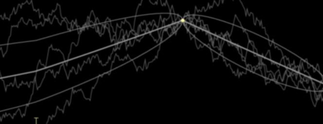

Click here to go to [research](#research) projects. 
Click here to go to [open source software](#open-source-software) projects.

 

# Research

Listed below are the research topics I am mainly interested in. 

 

    

        

            
        

    

## Probabilistic Numerics 

Probabilistic numerics (PN) can be seen as the overarching research topic I am interested in. Sub-topics I have worked on
are high-dimensional stochastic optimization for non-convex continuous functions, ordinary differential equation (ODE) solvers 
and integration routines (quadrature).
The general idea of PN is that the numerical quantity of interest is seen as a latent variable that is to be inferred.
Results of computations related to the unknown quantity are interpreted as 'data' and incorporated via a likelihood model.
For instance, an integral value can be inferred from integrand evaluations at several locations, or the
solutions of an ODE can be inferred from evaluations of the flow-field. 
Combined with a prior, PN-methods yield a posterior distribution on the unknown quantity that also models its numerical error.
Using some apparent connections to classic numerical methods, PN thus opens up the toolbox of probabilistic 
inference to be applied to numerical problems which seems to me a vast, exciting and largely unexplored research field.

I am contributing code related to probabilistic numerics mainly to the open source libraries [EmuKit](#emukit)
and [ProbNum](#probnum).

<ul style="list-style: none; margin: 0; padding: 0; display: inline-flex; font-size: 0.9em">
    <li><a class="button-projects" href="">
Site
</a></li>
    <li><a class="button-projects" href="">
Papers
</a></li>
</ul>

 

    

        

            
        

    

## Stochastic Optimization

High-dimensional stochastic, non-convex optimization (such as required to train neural networks) is fascinating to me.
How can we hope to make progress and find a minimizer in such a high-dimensional space with so little and information available? 
Are mini-batch gradients enough? Which quantities can we use to do better?
How do we handle the uncertainties?

It makes sense to me that novel quantities need to be considered, such as variances of statistics that describe their 
distributions, and that noise needs to be handled and quantified better.
I have worked on several aspects of stochastic optimization, such as line-searches, 
filtering for noise-reduced search directions, generalization and overfitting, or dynamic pruning during network training.
There are two related questions: How do we design better opimizers, and which quantities do we need? 
But also, how can we use the information contained in optimization steps, to solve other simultaneous, related tasks, 
such as pruning (network design) or overfitting? After all, the model, the optimization landscape, and the data interact.
I am highly motivated by these questions and their relation to probabilistic numerics (see above).
Please see my previous published work as well as my PhD thesis.

<ul style="list-style: none; margin: 0; padding: 0; display: inline-flex; font-size: 0.9em">
    <li><a class="button-projects" href="https://publikationen.uni-tuebingen.de/xmlui/handle/10900/84726">
Thesis
</a></li>
    <li><a class="button-projects" href="">
Papers
</a></li>
</ul>

 

    

        

            
        

    

## Bayesian Quadrature

Bayesian quadrature is a model-based approach to numerical integration similar to how Bayesian optimization is a model-based
approach to global optimization. 
It is a probabilistic numerical method (as described above) as it yields a posterior over the integral value,
possibly a richer quantity than a point estimate.
In the machine learning community, we rely heavily on 'solved' numerical concepts such as (auto-)differentiation, 
largely responsible for the success of discriminative models in supervised learning.
I am keen on exploring concepts that yield efficient, automated and reliable integration schemes that 
possibly tailors themselves to the user problem: In this sense, *auto-quad*, the sibling/inverse function to auto-diff.

I am contributing code on Bayesian quadrature mainly to the open source libraries [EmuKit](#emukit)
and [ProbNum](#probnum).

<ul style="list-style: none; margin: 0; padding: 0; display: inline-flex; font-size: 0.9em">
    <li><a class="button-projects" href="">
Papers
</a></li>
</ul>

 

 

# Open Source Software

The open source projects I mainly contribute to are related to the research topics above. 
Please see my [GitHub](https://github.com/mmahsereci) as well.

 

    

        

            
        

    

## EmuKit
I am one of the original authors and co-maintainer of the 
[EmuKit](https://github.com/EmuKit/emukit) Python library. 
EmuKit is a highly adaptable Python toolkit for decision-making under uncertainty. Its core components is an 
active learning loop that unifies several active machine learning methods such as experimental design, 
Bayesian optimization and Bayesian quadrature. 
EmuKit's design allows the user to customize the learning algorithm easily, 
by switching out or adding new components (plug-and-play). 
Further, EmuKit provides an interface for the surrogate model, such that custom models can be integrated into
the code quickly.

EmuKit is mostly designed for flexibility, and quick custom algorithm design for expert users. 
Thus, it is mostly applicable at the 'outer loop' wher ethe function  
Read more on EmuKit's structure 
[here](https://emukit.github.io/about/) or check it out on [GitHub](https://github.com/EmuKit/emukit).

<ul style="list-style: none; margin: 0; padding: 0; display: inline-flex; font-size: 0.9em">
    <li><a class="button-projects" href="https://github.com/EmuKit/emukit">
Code
</a></li>
    <li><a class="button-projects" href="https://emukit.github.io/">
Site
</a></li>
    <li><a class="button-projects" href="https://ml4physicalsciences.github.io/2019/files/NeurIPS_ML4PS_2019_113.pdf">
Paper
</a></li>
    <li><a class="button-projects" onclick="CollapseBibTeX('BibEntryEmukit')">
BibTeX
</a></li>
</ul>

  <blockquote style="border: 0px solid #666; padding: 10px; background-color: #2E3440;"> 
    

      @inproceedings{emukit2019,
        

          author = {Paleyes, Andrei and Pullin, Mark and Mahsereci, Maren and Lawrence, Neil and González, Javier}, 
          title = {Emulation of physical processes with Emukit}, 
          booktitle = {Second Workshop on Machine Learning and the Physical Sciences, NeurIPS}, 
          year = {2019}
        
  
      }
   

  </blockquote>

 

    

        

            
        

    

## ProbNum

I am a contributor and maintainer of the [ProbNum](https://github.com/probabilistic-numerics/probnum) Python library.
ProbNum provides numerical solvers for linear systems, intractable integrals and ordinary differential equations.
ProbNum's solvers not only estimate the solution of the numerical problem, but also its uncertainty (numerical error) which 
arises from finite computational resources, discretization and stochastic input. 
The estimated numerical uncertainty can be used in downstream decisions.

Lower level structure of ProbNum includes: A module for random variables and random variable arithmetics;
(memory-)efficient and lazy implementation of linear operators that integrate with random variables;
filtering and smoothing for probabilistic state-space models, mostly variants of Kalman filters.

<ul style="list-style: none; margin: 0; padding: 0; display: inline-flex; font-size: 0.9em">
    <li><a class="button-projects" href="https://github.com/probabilistic-numerics/probnum">
Code
</a></li>
    <li><a class="button-projects" href="http://www.probabilistic-numerics.org">
Site
</a></li>
</ul>

