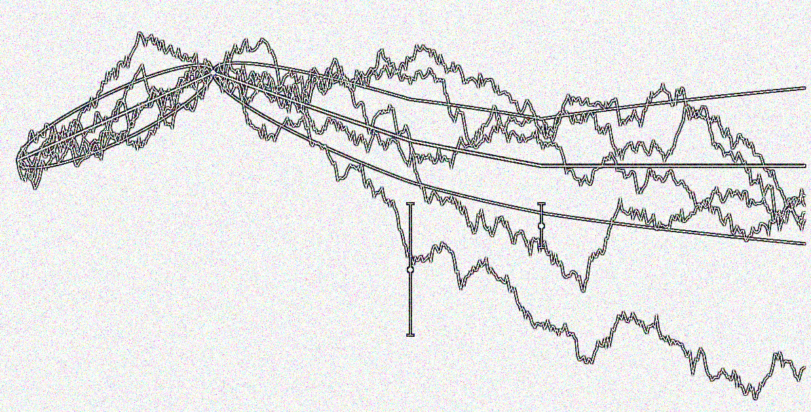
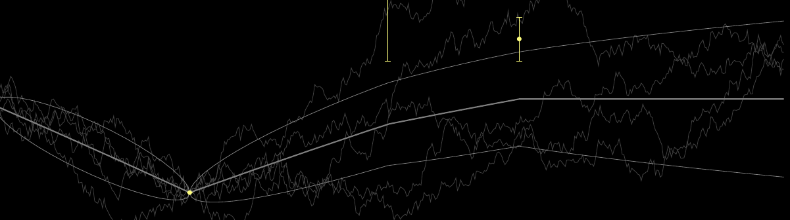
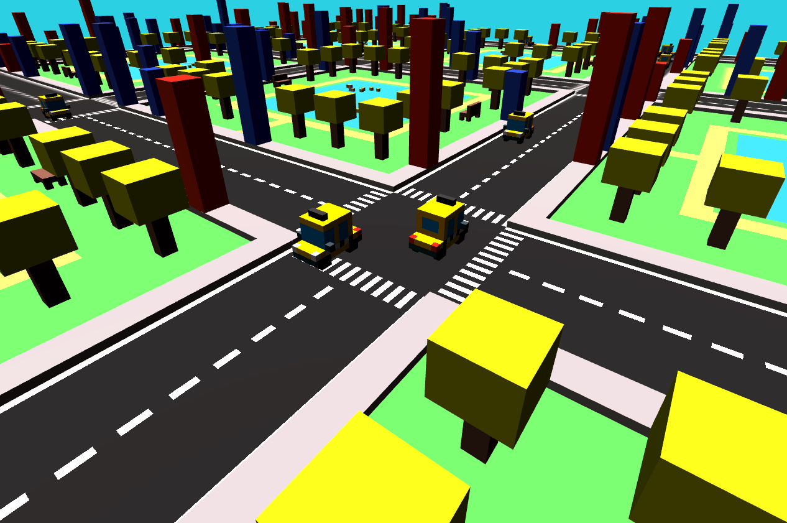
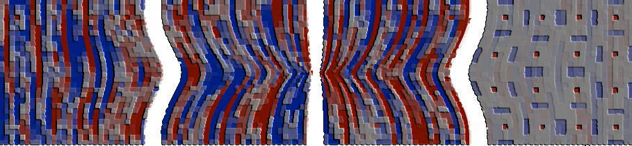

Click here to go to [research](#research) projects. 
Click here to go to [open source software](#open-source-software) projects.

 

# Research

Listed below are the research topics I am mainly interested in. 

    

        

            
        

    

## Stochastic Optimization

Empirical risk minimization for hiigh-dimensiona lobejctives, potetntiallhy a lot f data, stochsticity.
how can we even make progress in those spaces. It makes sens eto me than information or handling en noise is crucual
.Related pruning: how do we use the information of te optimizer to solve other simulatenous talsk, suh as orunig or overfitting.

I am ahighly motivated by these questions

<ul style="list-style: none; margin: 0; padding: 0; display: inline-flex; font-size: 0.9em">
    <li><a class="button-projects" href="">
Thesis
</a></li>
    <li><a class="button-projects" href="">
Papers
</a></li>
</ul>

    

        

            
        

    

## Probabilistic Numerics 

Probabilistic numerics (PN) can be seen as the overarching research topic I am interested in. Sub-topics I have worked on
are high-dimensional stochastic optimization for non-convex continuous functions, ordinary differential equation (ODE) solvers 
and integration routines (quadrature).
The general idea of PN is that the numerical quantity of interest is seen as a latent variable that is to be inferred.
Results of computations related to the unknown quantity are interpreted as 'data' an incorporated via a likelihood model.
Together with a prior, this yields a posterior on the unknown quantity that also models its numerical error.
For instance, an integral value can be inferred from evaluations of the integrand at several locations, or the
solutions of an ODE can be inferred from evaluations of the flow-field. 
Thus, using the apparent connections to classic numerical methods, PN opens up the toolbox of probabilistic 
inference to be applied to numerical problems which seems to me a vast, exciting and largely unexplored field.

<ul style="list-style: none; margin: 0; padding: 0; display: inline-flex; font-size: 0.9em">
    <li><a class="button-projects" href="">
Site
</a></li>
    <li><a class="button-projects" href="">
Papers
</a></li>
</ul>

    

        

            
        

    

## Bayesian Qudrature

Bayesian quadrature is a model-based approach to numerical integration similar to how Bayesian optimization is a model-based
approach to global optimization. 
It is a probabilistic numerical method (as described above) as it yields a posterior over the integral value,
possibly a richer quantity than a point estimate.
In the machine learning community, we rely heavily on 'solved' numerical concepts such as (auto-)differentiation, 
largely responsible for the success of discriminative models in supervised learning.
I am keen on exploring concepts that yield efficient, automated and reliable integration schemes that 
possibly tailors themselves to the user problem. In this sense, *auto-quad*, the sibling/inverse function to auto-diff.

I am contributing code on Bayesian quadrature, both in the [EmuKit](#emukit), 
and in the [ProbNum](#probnum) open source libraries (see below).

<ul style="list-style: none; margin: 0; padding: 0; display: inline-flex; font-size: 0.9em">
    <li><a class="button-projects" href="">
Papers
</a></li>
</ul>

 

# Open Source Software

The open source projects I mainly contribute to are related to the research topics above. 
Please see my [GitHub](https://github.com/mmahsereci) as well.

    

        

            
        

    

## EmuKit
I am one of the original authors and co-maintainer of the 
[EmuKit](https://github.com/EmuKit/emukit) Python library. 
EmuKit is a highly adaptable Python toolkit for decision-making under uncertainty. Its core components is an 
active learning loop that unifies several active machine learning methods such as experimental design, 
Bayesian optimization and Bayesian quadrature. 
EmuKit's design allows the user to customize the learning algorithm easily, 
by switching out or adding new components (plug-and-play). 
Further, EmuKit provides an interface for the surrogate model, such that custom models can be integrated into
the code quickly.
Read more on EmuKit's structure 
[here](https://emukit.github.io/about/) or check it out on [GitHub](https://github.com/EmuKit/emukit).

<ul style="list-style: none; margin: 0; padding: 0; display: inline-flex; font-size: 0.9em">
    <li><a class="button-projects" href="https://github.com/EmuKit/emukit">
Code
</a></li>
    <li><a class="button-projects" href="https://emukit.github.io/">
Site
</a></li>
    <li><a class="button-projects" href="https://ml4physicalsciences.github.io/2019/files/NeurIPS_ML4PS_2019_113.pdf">
Paper
</a></li>
    <li><a class="button-projects" onclick="CollapseBibTeX('BibEntryEmukit')">
BibTeX
</a></li>
</ul>

  <blockquote style="border: 0px solid #666; padding: 10px; background-color: #2E3440;"> 
    

      @inproceedings{emukit2019,
        

          author = {Paleyes, Andrei and Pullin, Mark and Mahsereci, Maren and Lawrence, Neil and González, Javier}, 
          title = {Emulation of physical processes with Emukit}, 
          booktitle = {Second Workshop on Machine Learning and the Physical Sciences, NeurIPS}, 
          year = {2019}
        
  
      }
   

  </blockquote>

    

        

            
        

    

## ProbNum

I am a contributor and maintainer of the [ProbNum](https://github.com/probabilistic-numerics/probnum) Python library.
ProbNum provides numerical solvers for linear systems, intractable integrals and ordinary differential equations.
ProbNum's solvers not only estimate the solution of the numerical problem, but also its uncertainty (numerical error) which 
arises from finite computational resources, discretization and stochastic input. 
The estimated numerical uncertainty can be used in downstream decisions.

Lower level structure of ProbNum includes: A module for random variables and random variable arithmetics;
(memory-)efficient and lazy implementation of linear operators that integrate with random variables;
filtering and smoothing for probabilistic state-space models, mostly variants of Kalman filters.

<ul style="list-style: none; margin: 0; padding: 0; display: inline-flex; font-size: 0.9em">
    <li><a class="button-projects" href="https://github.com/probabilistic-numerics/probnum">
Code
</a></li>
    <li><a class="button-projects" href="http://www.probabilistic-numerics.org">
Site
</a></li>
</ul>

