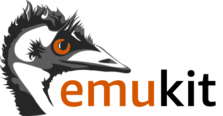

    

        

            
        

    

## Stochastic Optimization

sjfsfjsfiljfsal jflsfjafslafk fslfjlksdj safd  fjslfjlaf  

    

        

            
        

    

## Probabilistic Numerics 

sjfsfjsfiljfsal jflsfjafslafk fslfjlksdj safd  fjslfjlaf  

    

        

            
        

    

## Bayesian Qudrature

sjfsfjsfiljfsal jflsfjafslafk fslfjlksdj safd  fjslfjlaf  

---

 

    

        

            
        

    

## EmuKit
I am one of the original authors and co-maintainer of the 
[EmuKit](https://github.com/EmuKit/emukit) Python library. 
EmuKit is a highly adaptable Python toolkit for decision-making under uncertainty. Its core components is an 
active learning loop that unifies several active machine learning methods such as experimental design, 
Bayesian optimization and Bayesian quadrature. 
EmuKit's design allows the user to customize the active learning algorithms quickly, 
by switching out or adding new components, and even to wrap 
a custom surrogate models via an interface. Read more on EmuKit's structure 
[here](https://emukit.github.io/about/) or check it out on [GitHub](https://github.com/EmuKit/emukit).

<ul style="list-style: none; margin: 0; padding: 0; display: inline-flex; font-size: 0.9em">
    <li><a class="button-projects" href="https://github.com/EmuKit/emukit">
Code
</a></li>
    <li><a class="button-projects" href="https://ml4physicalsciences.github.io/2019/files/NeurIPS_ML4PS_2019_113.pdf">
Paper
</a></li>
    <li><a class="button-projects" onclick="CollapseBibTeX('BibEntryEmukit')">
BibTeX
</a></li>
</ul>

  <blockquote style="border: 0px solid #666; padding: 10px; background-color: #2E3440;"> 
    

      @inproceedings{emukit2019,
        

          author = {Paleyes, Andrei and Pullin, Mark and Mahsereci, Maren and Lawrence, Neil and González, Javier}, 
          title = {Emulation of physical processes with Emukit}, 
          booktitle = {Second Workshop on Machine Learning and the Physical Sciences, NeurIPS}, 
          year = {2019}
        
  
      }
   

  </blockquote>

    

        

            
        

    

## ProbNum

sjfsfjsfiljfsal jflsfjafslafk fslfjlksdj safd  fjslfjlaf  

